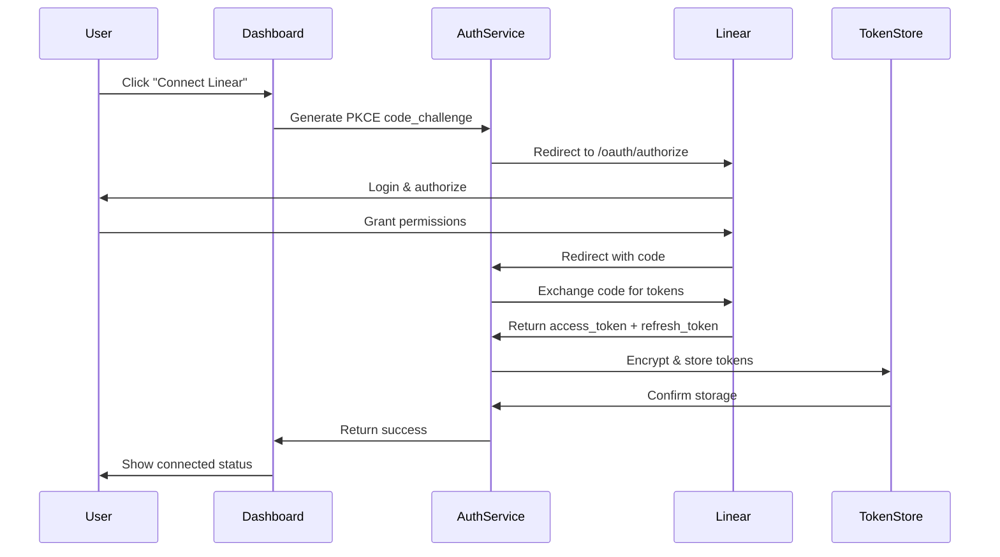
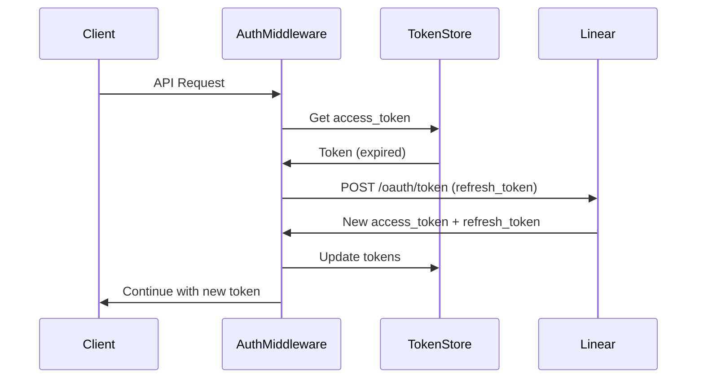
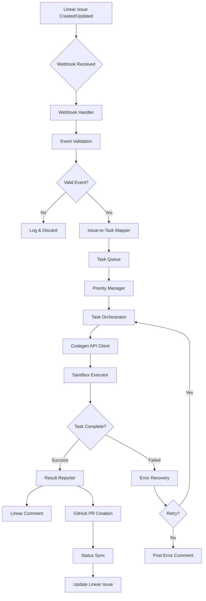
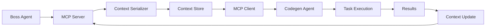

# 🏗️ Claude Code + Linear Integration - Architecture Document

**Version:** 1.0.0  
**Last Updated:** 2025-01-16  
**Status:** Design Phase

---

## 📋 Table of Contents

1. [System Overview](#system-overview)
2. [Core Components](#core-components)
3. [Authentication Flow](#authentication-flow)
4. [Data Flow](#data-flow)
5. [Technology Stack](#technology-stack)
6. [Integration Points](#integration-points)
7. [Security Architecture](#security-architecture)
8. [Scalability & Performance](#scalability--performance)

---

## 🌍 System Overview

### Vision

Создать полноценную интеграцию между Claude Code и Linear без зависимости от Cyrus customer ID, используя OAuth2 для безопасного доступа и Codegen API для автоматизации.

### Key Goals

- ✅ **OAuth2 Authentication:** Безопасный доступ к Linear без customer ID
- ✅ **Codegen API Integration:** Полная интеграция для автоматизации задач
- ✅ **MCP Context Management:** Правильная передача контекста между агентами
- ✅ **Modern UI/UX:** v0 liquid glass дизайн + shadcn/ui
- ✅ **High Performance:** <100ms webhook response time
- ✅ **Comprehensive Testing:** 70%+ coverage

### Architecture Principles

1. **Separation of Concerns** - Четкое разделение ответственности
2. **Async-First** - Асинхронные операции для высокой производительности
3. **Event-Driven** - Webhook-based архитектура
4. **Type-Safe** - TypeScript для type safety
5. **Testable** - Высокая тестируемость
6. **Secure by Default** - Безопасность встроена

---

## 🧩 Core Components

### 1. Authentication Layer (`src/auth/`)

```
src/auth/
├── oauth2/
│   ├── authorize.ts       # OAuth2 authorization endpoint
│   ├── callback.ts        # OAuth2 callback handler
│   └── refresh.ts         # Token refresh logic
├── storage/
│   └── token-store.ts     # Secure token storage
├── middleware/
│   └── oauth2.ts          # Fastify OAuth2 middleware
├── workspaces/
│   └── manager.ts         # Multi-workspace support
├── crypto/
│   └── encryption.ts      # Token encryption
└── errors/
    └── oauth2-errors.ts   # OAuth2 error handling
```

**Responsibilities:**
- OAuth2 flow management
- Token lifecycle (issue, refresh, revoke)
- Multi-workspace support
- Secure token storage & encryption

**Key Features:**
- AES-256 encryption для tokens
- Automatic token refresh
- Multi-tenant architecture
- PKCE for additional security

### 2. Codegen Integration Layer (`src/codegen/`)

```
src/codegen/
├── client/
│   ├── api-client.ts      # Codegen API client
│   ├── error-handler.ts   # Error handling & retries
│   └── response-cache.ts  # Response caching
├── auth/
│   └── service.ts         # Codegen authentication
├── sandbox/
│   └── executor.ts        # Sandbox execution wrapper
├── logging/
│   └── api-logger.ts      # API request logging
├── types/
│   └── api-types.ts       # TypeScript interfaces
└── __tests__/
    └── api-client.test.ts # Unit & integration tests
```

**Responsibilities:**
- Codegen API communication
- Rate limiting & retry logic
- Sandbox execution management
- Response caching

**Key Features:**
- Rate limiter (rate-limiter-flexible)
- Exponential backoff retry
- TTL-based caching
- Comprehensive error handling

### 3. Linear-Codegen Bridge (`src/bridge/`)

```
src/bridge/
├── mappers/
│   └── issue-to-task.ts      # Issue → Task mapping
├── handlers/
│   └── issue-event-handler.ts # Linear event processing
├── orchestrator/
│   └── task-orchestrator.ts   # Task execution orchestration
├── reporters/
│   └── comment-poster.ts      # Results → Linear comments
├── github/
│   └── pr-creator.ts          # PR creation automation
├── automation/
│   └── code-reviewer.ts       # Code review automation
├── cicd/
│   └── hooks.ts               # CI/CD integration
├── queue/
│   ├── task-queue.ts          # Task queuing
│   └── priority-manager.ts    # Priority management
├── sync/
│   └── status-sync.ts         # Status synchronization
├── recovery/
│   └── error-recovery.ts      # Error recovery mechanisms
├── metrics/
│   └── task-metrics.ts        # Execution metrics
└── __tests__/
    ├── integration.test.ts    # Integration tests
    └── e2e.test.ts            # E2E tests
```

**Responsibilities:**
- Linear ↔ Codegen data mapping
- Event processing & orchestration
- Task execution management
- Results reporting

**Key Features:**
- Priority-based queue
- Automatic retry & recovery
- GitHub PR automation
- Real-time status sync

### 4. MCP Layer (`src/mcp/`)

```
src/mcp/
├── server.ts                   # MCP server
├── client.ts                   # MCP client
├── schemas/
│   └── context-schema.ts       # Context schemas (Zod)
├── serialization/
│   └── serializer.ts           # Context serialization
├── coordinator/
│   └── session-coordinator.ts  # Session coordination
├── versioning/
│   └── context-versioning.ts   # Context versioning
├── pruning/
│   └── strategies.ts           # Context pruning
├── middleware/
│   └── boss-agent-middleware.ts # Boss Agent integration
├── debug/
│   └── tools.ts                # Debugging tools
└── __tests__/
    └── integration.test.ts     # MCP tests
```

**Responsibilities:**
- Model Context Protocol implementation
- Context management & versioning
- Session coordination
- Context pruning strategies

**Key Features:**
- Zod schemas для validation
- Automatic context pruning
- Version tracking
- Boss Agent integration

### 5. Session Management (`src/sessions/`)

```
src/sessions/
├── manager.ts                  # Session lifecycle
├── mcp-session.ts              # MCP-aware sessions
├── persistence/
│   └── context-store.ts        # Context persistence
├── recovery/
│   └── recovery-manager.ts     # Session recovery
├── analytics/
│   └── tracker.ts              # Session analytics
├── cleanup/
│   └── auto-cleanup.ts         # Automatic cleanup
├── coordination/
│   └── multi-agent.ts          # Multi-agent coordination
├── migration/
│   └── migrator.ts             # Session migration
├── sharing/
│   └── share-manager.ts        # Session sharing
├── audit/
│   └── audit-logger.ts         # Security audit logging
└── __tests__/
    └── session-mgmt.test.ts    # Session tests
```

**Responsibilities:**
- Session lifecycle management
- Context persistence
- Multi-agent coordination
- Security audit logging

**Key Features:**
- Automatic cleanup
- Session recovery
- Analytics tracking
- Secure sharing

### 6. Web Dashboard (`web/`)

```
web/
├── app/
│   └── dashboard/              # Next.js 15 app router
├── src/
│   ├── components/
│   │   ├── v0/
│   │   │   └── background-paths.tsx  # Liquid glass effects
│   │   ├── auth/
│   │   │   ├── oauth2-config.tsx     # OAuth2 configuration
│   │   │   └── connection-panel.tsx  # Connection interface
│   │   ├── layout/
│   │   │   └── dashboard-layout.tsx  # Main layout
│   │   ├── file-manager/
│   │   │   └── index.tsx             # File manager
│   │   ├── tables/
│   │   │   └── task-table.tsx        # Dynamic task table
│   │   ├── ai/
│   │   │   └── elements.tsx          # AI SDK 5 elements
│   │   ├── dashboard/
│   │   │   └── task-monitor.tsx      # Task monitoring
│   │   ├── tasks/
│   │   │   └── create-task.tsx       # Task creation
│   │   ├── code-review/
│   │   │   └── interface.tsx         # Code review UI
│   │   ├── metrics/
│   │   │   └── visualizations.tsx    # Metrics viz
│   │   ├── settings/
│   │   │   └── panel.tsx             # Settings
│   │   ├── notifications/
│   │   │   └── system.tsx            # Notifications
│   │   └── users/
│   │       └── management.tsx        # User management
│   ├── lib/
│   │   ├── theme-config.ts           # shadcn/ui theme
│   │   └── websocket-client.ts       # WebSocket client
│   ├── styles/
│   │   └── liquid-glass.css          # Liquid glass styles
│   └── __tests__/                    # Component tests
└── public/                            # Static assets
```

**Responsibilities:**
- User interface
- Real-time updates
- OAuth2 configuration
- Task management

**Key Features:**
- Next.js 15 (App Router)
- shadcn/ui components
- Liquid glass design
- WebSocket real-time updates
- Monaco Editor для code review

---

## 🔐 Authentication Flow

### OAuth2 Authorization Flow (PKCE)



### Token Refresh Flow



---

## 📊 Data Flow

### Linear Issue → Codegen Task Flow



### MCP Context Flow



---

## 🛠️ Technology Stack

### Backend

| Component | Technology | Version | Purpose |
|-----------|-----------|---------|---------|
| Runtime | Node.js | 18+ | JavaScript runtime |
| Language | TypeScript | 5.9+ | Type-safe development |
| Web Server | Fastify | 4.29+ | High-performance HTTP server |
| Linear SDK | @linear/sdk | 26+ | Linear API integration |
| Codegen | @anthropic-ai/claude-code | 1.0.128+ | Claude Code integration |
| MCP | @tacticlaunch/mcp-linear | 1.0.12+ | Model Context Protocol |
| GitHub | @octokit/rest | 20+ | GitHub API integration |
| Validation | Zod | 3.25+ | Schema validation |
| Testing | Vitest | 4+ | Unit & integration testing |
| Rate Limiting | rate-limiter-flexible | 7.4+ | API rate limiting |
| Memory | Mem0AI | 2.1+ | AI memory management |

### Frontend

| Component | Technology | Version | Purpose |
|-----------|-----------|---------|---------|
| Framework | Next.js | 15+ | React framework (App Router) |
| UI Library | shadcn/ui | Latest | Component library |
| Styling | Tailwind CSS | 3+ | Utility-first CSS |
| Icons | Lucide React | Latest | Icon library |
| Animations | Framer Motion | Latest | Animation library |
| Forms | React Hook Form | Latest | Form management |
| Tables | TanStack Table | Latest | Data tables |
| Charts | Recharts | Latest | Data visualization |
| Code Editor | Monaco Editor | Latest | Code review interface |
| WebSocket | Native WebSocket | - | Real-time updates |

### DevOps & Tools

| Component | Technology | Purpose |
|-----------|-----------|---------|
| Package Manager | npm | Dependency management |
| Linting | ESLint | Code linting |
| Formatting | Prettier | Code formatting |
| Code Search | ripgrep (rg) | Fast code search |
| File Search | fd | Fast file discovery |
| AST Manipulation | ast-grep | Code refactoring |
| Config Processing | jq/yq | JSON/YAML processing |
| CI/CD | GitHub Actions / CircleCI | Continuous integration |
| Security | TruffleHog / Bandit | Secret scanning |
| Monitoring | Custom metrics | Performance tracking |

---

## 🔌 Integration Points

### 1. Linear API

**Base URL:** `https://api.linear.app/graphql`

**Authentication:** OAuth2 Bearer token

**Key Operations:**
- Fetch issues
- Create/update comments
- Update issue status
- Attach PR links

**Webhook Events:**
- `Issue` - Issue created/updated
- `Comment` - Comment created
- `IssueLabel` - Label added/removed
- `Project` - Project updates

### 2. Codegen API

**Base URL:** `https://api.codegen.com`

**Authentication:** API key

**Key Operations:**
- Create agent runs
- Execute code in sandbox
- Fetch run results
- Cancel/retry runs

**Rate Limits:**
- 100 requests/min (authenticated)
- Exponential backoff on 429

### 3. GitHub API

**Base URL:** `https://api.github.com`

**Authentication:** OAuth2 or Personal Access Token

**Key Operations:**
- Create PRs
- Request reviews
- Add comments
- Update PR status

### 4. Vercel (Deployment)

**Platform:** Vercel Edge Network

**Features:**
- Auto-deployment from git
- Edge Functions
- Web Preview URLs
- Environment variables

---

## 🔒 Security Architecture

### Threat Model

| Threat | Mitigation | Implementation |
|--------|-----------|----------------|
| Token theft | AES-256 encryption | `src/auth/crypto/encryption.ts` |
| CSRF attacks | State parameter | OAuth2 PKCE flow |
| Man-in-the-middle | HTTPS only | Fastify TLS config |
| Injection attacks | Input validation | Zod schemas |
| Rate limiting bypass | Rate limiter | rate-limiter-flexible |
| Secrets in code | Environment vars | .env + secret management |
| Unauthorized access | OAuth2 scopes | Middleware checks |

### Security Best Practices

1. **Token Management:**
   - Encrypted at rest (AES-256)
   - Short-lived access tokens (1h)
   - Automatic refresh
   - Secure deletion on logout

2. **Input Validation:**
   - Zod schemas для всех входных данных
   - Sanitization before processing
   - Type checking (TypeScript)

3. **Audit Logging:**
   - All authentication events
   - Token operations
   - Failed access attempts
   - Security-relevant actions

4. **Network Security:**
   - HTTPS только
   - CORS configuration
   - CSP headers
   - Rate limiting

---

## ⚡ Scalability & Performance

### Performance Targets

| Metric | Target | Current |
|--------|--------|---------|
| Webhook Response Time | <100ms | ~25ms ✅ |
| Task Queue Processing | <500ms | TBD |
| Dashboard Load Time | <2s | TBD |
| Test Coverage | 70%+ | TBD |
| API Success Rate | >99% | TBD |
| Uptime | >99.9% | TBD |

### Scalability Strategies

1. **Horizontal Scaling:**
   - Stateless application design
   - Session storage в external store
   - Load balancer ready

2. **Caching:**
   - Response caching (TTL-based)
   - Static asset CDN (Vercel)
   - Browser caching headers

3. **Queue Management:**
   - Priority-based queue
   - Concurrent task processing
   - Rate limiting

4. **Database Optimization:**
   - Indexed queries
   - Connection pooling
   - Query optimization

### Monitoring & Observability

1. **Metrics:**
   - Request latency (p50, p95, p99)
   - Error rates
   - Task queue depth
   - Token refresh rate

2. **Logging:**
   - Structured logging (JSON)
   - Log levels (DEBUG, INFO, WARN, ERROR)
   - Context propagation
   - Searchable logs

3. **Alerting:**
   - High error rate
   - Slow response time
   - Queue backlog
   - Failed authentication

---

## 📚 References

- [Linear API Documentation](https://developers.linear.app/)
- [Codegen API Documentation](https://docs.codegen.com/)
- [OAuth 2.0 RFC](https://tools.ietf.org/html/rfc6749)
- [PKCE RFC](https://tools.ietf.org/html/rfc7636)
- [Next.js Documentation](https://nextjs.org/docs)
- [shadcn/ui Components](https://ui.shadcn.com/)

---

**Document Status:** Living document, updated as architecture evolves

**Last Review:** 2025-01-16

**Next Review:** After Phase 1 completion

